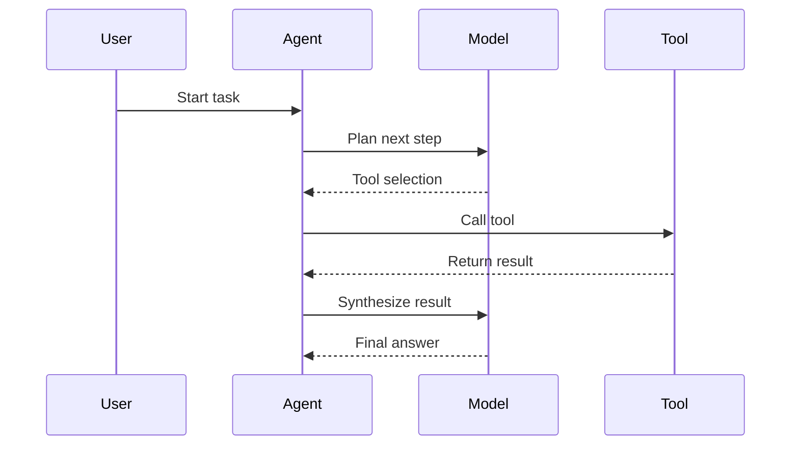

# Report Template

Use this template unless the user asks for a different format.

```markdown
# Runtime Observability Report

## Execution Summary
- Session: {session_id_or_label}
- Input source: {session_logs|json_file|event_stream|unknown}
- Confidence: {high|medium|low}
- Total duration: {duration}
- Total tool calls: {tool_call_count}
- Total model calls: {model_call_count}
- Total tokens: {token_total_or_unknown}
- Overall quality score: {score}/100

## Headline Findings
- {finding_1}
- {finding_2}
- {finding_3}

## Execution Timeline
| Step | Time | Type | Name | Duration | Tokens | Notes |
|------|------|------|------|----------|--------|-------|
| 1 | {ts} | tool | {name} | {duration} | {tokens} | {note} |

## Token And Cost Breakdown

### By tool
| Tool | Calls | Tokens | Share | Notes |
|------|-------|--------|-------|-------|

### By model
| Model | Calls | Input tokens | Output tokens | Notes |
|-------|-------|--------------|---------------|-------|

### Anomalies
- {anomaly_or_none}

## Decision Points
- {decision_point}: observed={observed}; inferred={inferred}; impact={impact}

## Quality Review

### Output compliance
- Score: {score}/35
- Notes: {notes}

### Factual grounding
- Score: {score}/40
- Notes: {notes}

### Scope discipline
- Score: {score}/25
- Notes: {notes}

## Issues
- Severity: {high|medium|low}; Issue: {issue}; Evidence: {evidence}; Fix: {fix}

## Recommended Actions
1. {action_1}
2. {action_2}
3. {action_3}

## Data Gaps
- {missing_field_or_none}

## Appendix
- Source logs: {source_description}
- Estimation notes: {estimation_notes_or_none}
```

## Diagram Mode

If the user asks for a visual trace, append a Mermaid diagram after the report:

````markdown
## Sequence Diagram


````

Only include participants that actually appeared in the logs.
